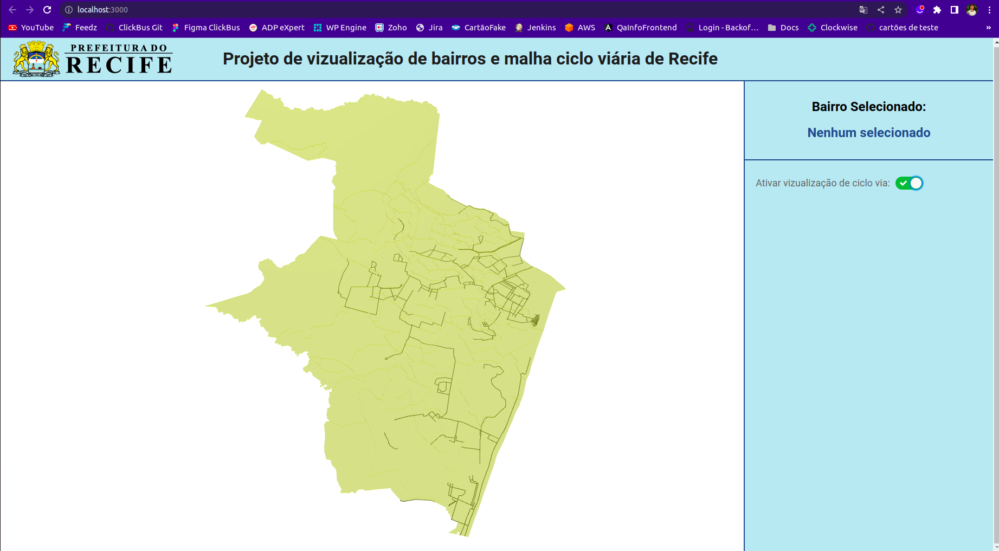

# Vizualização do mapa e ciclovias de Recife

## Inicializar projeto

No diretório do projeto rode o comando:

### `npm start`

Para gerar um build rode o comando:

### `npm run build`

# Interface do projeto

